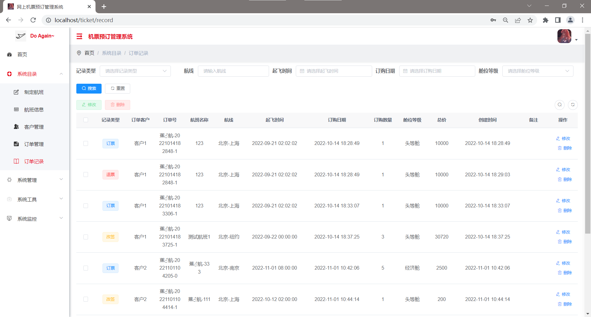

<h1 align="center" style="margin: 30px 0 30px; font-weight: bold;">网上机票预订管理系统</h1>
<h4 align="center">基于 Vue/Element UI 和 Spring Boot/Spring Cloud & Alibaba 前后端分离的分布式微服务架构</h4>

## 项目简介

本系统使用若依平台进行开发，仅作学习使用。

* 采用前后端分离的模式，微服务版本前端(基于 [RuoYi-Vue](https://gitee.com/y_project/RuoYi-Vue))。
* 后端采用Spring Boot、Spring Cloud & Alibaba。
* 注册中心、配置中心选型Nacos，权限认证使用Redis。
* 流量控制框架选型Sentinel，分布式事务选型Seata。

#### 友情链接 [若依官网](http://ruoyi.vip/)
## 系统模块

~~~
com.ruoyi     
├── ruoyi-ui              // 前端框架 [80]
├── ruoyi-gateway         // 网关模块 [8080]
├── ruoyi-auth            // 认证中心 [9200]
├── ruoyi-api             // 接口模块
│       └── ruoyi-api-system                          // 系统接口
├── ruoyi-common          // 通用模块
│       └── ruoyi-common-core                         // 核心模块
│       └── ruoyi-common-datascope                    // 权限范围
│       └── ruoyi-common-datasource                   // 多数据源
│       └── ruoyi-common-log                          // 日志记录
│       └── ruoyi-common-redis                        // 缓存服务
│       └── ruoyi-common-security                     // 安全模块
│       └── ruoyi-common-swagger                      // 系统接口
├── ruoyi-modules         // 业务模块
│       └── ruoyi-system                              // 系统模块 [9201]
│       └── ruoyi-gen                                 // 代码生成 [9202]
│       └── ruoyi-job                                 // 定时任务 [9203]
│       └── ruoyi-file                                // 文件服务 [9300]
│       └── ticket                                    // 机票预订系统 [9888]
├── ruoyi-visual          // 图形化管理模块
│       └── ruoyi-visual-monitor                      // 监控中心 [9100]
├──pom.xml                // 公共依赖
~~~

## 演示图

<table>
    <tr>
        <td></td>
        <td></td>
    </tr>
    <tr>
        <td></td>
        <td></td>
    </tr>
    <tr>
        <td></td>
        <td></td>
    </tr>
    <tr>
        <td></td>
    </tr>
</table>

## 使用说明

1、本项目中 redis 未设置密码，nacos 使用默认密码。

2、初始化数据库：分别创建三个数据库(ry-cloud、ry-config、ry-seata)，再分别执行本项目中“sql-my”文件下三个sql文件即可

## 配置教程 
[若链接失效可自行搜索若依cloud部署教程](http://t.csdn.cn/bKEPN)

